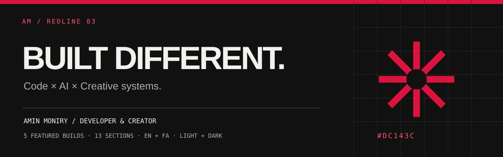
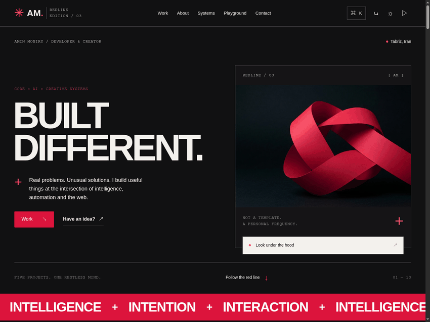
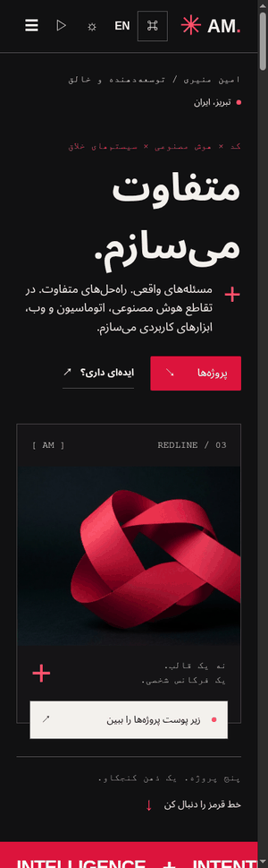
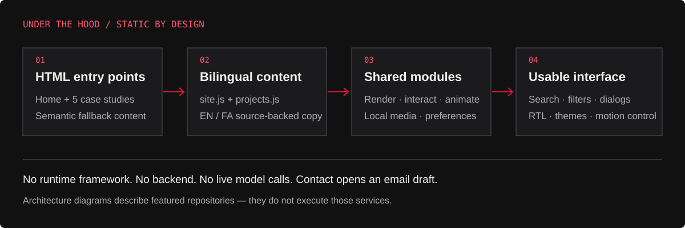

<div align="center">

<a href="https://allin1wrench.ir/">
  
</a>

# ALLin1Wrench / REDLINE 03

**Amin Moniry's bilingual portfolio — real builds, visible systems, honest interfaces.**

> **Matrix visual upgrade:** the current site adds a crimson Matrix animation layer, cinematic introduction, scroll narrative and pointer field without replacing project data or business logic. The original typewriter footer and signature path/star/chapter animations have also been adapted. The crimson screenshots below document the preceding REDLINE baseline. [Animation implementation, tests and rollback guide](redline/docs/MATRIX-UPGRADE.md).

[](https://allin1wrench.ir/)
[](#the-idea)
[](#bilingual-by-design)
[](LICENSE)

[**Explore the website ↗**](https://allin1wrench.ir/) · [**فارسی**](README.fa.md) · [**Selected work**](#five-builds-five-different-problems) · [**Run locally**](#run-locally) · [**Engineering**](#under-the-hood)

</div>

---

## The first impression

[](https://allin1wrench.ir/?lang=en&theme=dark)

> **Actual website capture, not a design mockup.** The crimson ribbon is the site's main artwork. The documentation preview is a self-contained, color-reduced SVG encoding of the captured image; it is not a live embed. [Open the live version](https://allin1wrench.ir/?lang=en&theme=dark) to experience the motion and interactions.

<details>
<summary><strong>See the Persian mobile experience</strong></summary>
<br>
<p align="center">
  <a href="https://allin1wrench.ir/?lang=fa&theme=dark"></a>
</p>

The Persian edition changes reading direction, layout and interface copy — not just the navigation labels.

</details>

## The idea

**Built different.** Not because of an oversized technology list, but because the work can be inspected.

ALLin1Wrench brings web interfaces, AI pipelines, automation and interactive 3D into one personal portfolio. Five featured projects each have their own story: the problem, implementation, engineering decisions, capabilities, limitations and original source links.

The REDLINE identity combines **crimson `#DC143C`**, near-black surfaces, oversized editorial typography, fine borders and a restrained system of arrows, plus signs and numbered sections. A light theme offers the same identity on a warm paper-like background.

**The guiding rule:** show the build, explain the system, distinguish claims from measurements.

| At a glance | In this edition |
| :--- | :--- |
| Featured work | **5** source-backed project case studies |
| Home journey | **13** main sections, including the closing section |
| Language | English + Persian, LTR + RTL |
| Appearance | Dark + light themes |
| Runtime | HTML, CSS and vanilla JavaScript; no runtime framework |
| Hosting | Static files on GitHub Pages with the existing custom domain |
| Contact | Email-draft preparation, not a backend mail service |

## Five builds. Five different problems.

| Project | What it explores | Project stack¹ | Case study / source |
| :--- | :--- | :--- | :--- |
| **TeleBrief** | Turning many Telegram channels into a bilingual, source-linked digest through a two-stage AI filtering pipeline | Python · Telethon · LLM APIs | [Case study](https://allin1wrench.ir/redline/work/telebrief.html) · [Repository](https://github.com/Amin-Moniry/TeleBrief) |
| **Executive Bot** | One Telegram conversation connecting self-hosted orchestration, workspace tools and AI model options | n8n · Docker · Gemini · Ollama | [Case study](https://allin1wrench.ir/redline/work/executive-bot.html) · [Repository](https://github.com/Amin-Moniry/n8n_ExecutiveBot_Platform) |
| **DetectSafeVisionX** | A desktop interface around detection of helmets, masks, smoking, fire and smoke | YOLO · OpenCV · PyQt6 | [Case study](https://allin1wrench.ir/redline/work/safevision.html) · [Repository](https://github.com/Amin-Moniry/DetectMultiObject-for-Helmets-Masks-Fire-Smoke-Smoking) |
| **BotAM** | Persian-friendly Telegram translation with language detection and alternative translation providers | Python · Telegram Bot API · Translation providers | [Case study](https://allin1wrench.ir/redline/work/botam.html) · [Repository](https://github.com/Amin-Moniry/BotAM) |
| **3D Visualizer** | Portable inspection of GLB / GLTF models in a standalone browser-based viewer | Three.js · GLTFLoader · WebGL | [Case study](https://allin1wrench.ir/redline/work/3d-visualizer.html) · [Repository](https://github.com/Amin-Moniry/3D_Visualizer) |

¹ These are the **featured projects' technologies**, not dependencies required to run this portfolio.

### What every case study contains

- **The problem:** what the tool is trying to make easier.
- **Under the hood:** modules, boundaries and implementation choices.
- **An engineering decision:** one consequential design trade-off.
- **What it does:** concrete capabilities, without invented business results.
- **System flow:** a simplified architecture reconstructed from the linked source.
- **Limits & dependencies:** what must be configured and what is not guaranteed.
- **Source trail:** links to the original README and relevant implementation files.

### Visual evidence, clearly labeled

- **TeleBrief:** original repository artwork; not presented as an application screenshot.
- **Executive Bot:** actual n8n workflow screenshot, cropped to remove browser chrome.
- **DetectSafeVisionX:** original detection examples from the repository.
- **BotAM:** editorial language/architecture visual, explicitly not an app screenshot.
- **3D Visualizer:** actual model-viewer screenshots, including a loaded model.

The case studies do not claim invented customers, accuracy scores, commercial impact, response times or guaranteed uptime. See the [project-source audit](redline/docs/PROJECT-SOURCES.md).

## A complete editorial journey

| Section | Purpose |
| :--- | :--- |
| **01 / Home** | Identity, positioning, crimson artwork and primary paths into the work |
| **02 / About** | Builder introduction, location, languages and mindset |
| **03 / Selected work** | Five project cards, category filtering and case-study links |
| **04 / Archive** | Smaller tools, earlier experiments and work still in development |
| **05 / Capabilities** | AI, automation and interface skills tied to actual projects |
| **06 / Systems** | Switchable architecture summaries for all five featured builds |
| **07 / Approach** | Understand → connect → make it usable → verify and refine |
| **08 / Playground** | Two local, interactive experiments: Signal Field and Language Mirror |
| **09 / Build log** | A timeline grounded in public repository creation dates |
| **10 / Engineering notes** | Short observations about fallbacks, portability and detection limits |
| **11 / FAQ** | Practical answers about the tools, visuals and contact flow |
| **12 / Contact** | Public contact details and an explicitly draft-only email form |
| **13 / Closing** | A final branded end to the page journey |

Repository creation dates in the build log are **not employment history or release dates**.

## Interaction with a purpose

### Find the right work

- Open quick search with **Ctrl + K** or **⌘ + K**.
- Search by project or technology, move through results using the keyboard and dismiss with **Esc**.
- Filter the five selected projects by category.
- Switch architecture tabs to inspect each project's flow.
- Enlarge project images in a native dialog.
- Use the mobile navigation dialog on narrow layouts.

### Motion, not obstruction

Title entry, short scroll reveals, restrained pointer parallax, magnetic-button feedback and staged architecture nodes add character without making animation a prerequisite for reading.

There is **no blocking preloader and no global replacement cursor**. The motion control and `prefers-reduced-motion` allow the experience to become quieter. The Signal Field canvas has its own play/pause and frequency controls.

### Local experiments, no pretend AI

| Experiment | What it actually does |
| :--- | :--- |
| **Signal Field** | Draws a local waveform; lets the visitor change frequency and control phase animation |
| **Language Mirror** | Previews user-entered typography in automatic, LTR or RTL direction; **it is not a translator** |

Neither experiment sends model requests, consumes AI tokens or calls an external API.

## Bilingual by design

The English and Persian editions share the same information architecture, while adapting interface copy, reading direction, layout and typography.

- Persian uses `lang="fa"` and right-to-left direction.
- Technical project names and technology labels remain readable in mixed-script layouts.
- Language and theme preferences are retained locally when browser storage is available.
- Theme selection can start from the system preference when no explicit choice is stored.
- Native controls, visible focus indicators, keyboard interactions and non-JavaScript fallback content are included.

Try a specific edition:

| English | فارسی |
| :--- | :--- |
| [Dark](https://allin1wrench.ir/?lang=en&theme=dark) | [تیره](https://allin1wrench.ir/?lang=fa&theme=dark) |
| [Light](https://allin1wrench.ir/?lang=en&theme=light) | [روشن](https://allin1wrench.ir/?lang=fa&theme=light) |

These features are not a claim of complete accessibility certification. The validation scope is documented below.

## Design system

| Token | Dark edition | Light edition |
| :--- | :--- | :--- |
| Brand | `#DC143C` | `#DC143C` |
| Background | `#111112` | `#F4F2ED` |
| Surface | `#1B1B1E` | `#EAE7E1` |
| Main text | `#F3F1ED` | `#171719` |
| Muted text | `#B0AEB1` | `#626067` |
| Text / interface accent | `#FF526F` | `#C11237` |

The brighter/darker text accents preserve the crimson identity while serving contrast needs on different backgrounds. Layout uses CSS Grid and Flexbox, fluid type, shared custom properties and an intentionally small set of interface motifs.

## Under the hood



```text
HTML entry points
  ├── bilingual content / site.js + projects.js
  ├── core primitives / state + escaping + route helpers
  ├── section and case-study rendering
  ├── interaction handlers / dialogs + filters + search + draft form
  ├── motion / progressive reveal + limited pointer effects
  └── local media / near-viewport loading + promise cache
```

### Runtime choices

- **Semantic HTML:** entry pages and fallback content.
- **CSS:** three active style modules, shared tokens and responsive / motion rules.
- **Vanilla JavaScript:** shared primitives, rendering, interaction and motion modules.
- **Native browser APIs:** `IntersectionObserver`, `<dialog>`, `<details>`, Canvas and local preference storage.
- **Static hosting:** no portfolio backend, database, login or AI service to configure.

### Media packaging

The repository's current delivery uses **local JSON files containing image data URIs** and **embedded font data in CSS**. This packaging was chosen because the publishing connection used for this edition accepts text files.

Images are requested near the viewport using `IntersectionObserver`, with a promise cache; the hero is eager. The whole project gallery is **not** fetched upfront. Native WebP / WOFF originals are available in the delivered source archive. Font license notices are retained under [`redline/licenses/`](redline/licenses/).

README screenshots are kept separately in [`docs/readme/`](docs/readme/); they are documentation assets, not added to the site's initial payload.

### Security and service boundaries

- User-entered Language Mirror text is escaped before rendering.
- External links use safe protocols; new-tab links include `noopener noreferrer`.
- No Telegram, Google Workspace or model credentials are needed for the website.
- System diagrams **describe** the featured tools; they do not run those tools.
- Availability and accuracy of linked third-party projects are outside this portfolio's guarantees.

## Repository map

```text
ALLin1Wrench/
├── index.html                 # Published REDLINE home; loads redline/ modules
├── CNAME                      # Existing custom domain, retained
├── LICENSE                    # Repository licensing terms
├── README.md                  # This English overview
├── README.fa.md               # Persian overview
├── docs/readme/               # Crimson banner, actual captures, architecture visual
├── redline/
│   ├── index.html             # REDLINE directory entry
│   ├── content/
│   │   ├── site.js            # Bilingual home/interface content
│   │   └── projects.js        # Case-study content and original source links
│   ├── scripts/
│   │   ├── core.js            # State, escaping and shared primitives
│   │   ├── sections.js        # Home and case-study rendering
│   │   ├── interactions.js    # Search, dialogs, filters, language and contact
│   │   ├── motion.js          # Motion and reduced-motion behavior
│   │   └── app.js             # Application initialization
│   ├── styles/
│   │   ├── base.css           # Typography, palette and global primitives
│   │   ├── components.css     # Components and section layouts
│   │   └── responsive-motion.css
│   ├── assets/media/          # Local encoded image payloads
│   ├── assets/favicon.svg
│   ├── work/                  # Five standalone case-study routes
│   ├── tests/regression.cjs   # Chromium regression suite
│   ├── docs/                  # Research, source audit and QA evidence
│   └── licenses/              # Bundled font notices
└── html/ · css/ · js/ · pics/ # Retained legacy files, not the active v3 module tree
```

Older REDLINE files also remain in the repository. For the active edition, follow the script and style paths loaded by the root `index.html`, rather than assuming every retained file is a current entry point.

## Run locally

**Requirements:** Git, Python 3 and a modern browser. No package install is needed to run the site.

```bash
git clone https://github.com/Amin-Moniry/ALLin1Wrench.git
cd ALLin1Wrench
python3 -m http.server 8080
```

Open **http://localhost:8080/**. To force Persian and dark mode, use:

```text
http://localhost:8080/?lang=fa&theme=dark
```

Serve the repository over HTTP; do not rely on opening `index.html` directly through `file://`, because local media payloads are fetched by the browser.

### Editing guide

| Change | Start here |
| :--- | :--- |
| Home copy, FAQ or interface labels | `redline/content/site.js` |
| Project descriptions, capabilities and source links | `redline/content/projects.js` |
| Palette, type and global spacing | `redline/styles/base.css` |
| Section/component appearance | `redline/styles/components.css` |
| Narrow layouts and motion overrides | `redline/styles/responsive-motion.css` |
| Search, menus, gallery or form behavior | `redline/scripts/interactions.js` |
| Reveal and pointer motion | `redline/scripts/motion.js` |

Keep English and Persian content in sync, preserve fallback HTML when changing case pages, and test both directions after modifying layouts. Local modification does not override the repository's distribution restrictions; see [License](#license).

## Validation, with boundaries

**606 passing Chromium checks, zero failures in the recorded release runs.** The same suite passed for native-source and text-packaged delivery; it is not counted as 1,212 distinct tests.

- Widths: **360, 390, 768, 1024, 1440 and 2560 px**.
- English/Persian and light/dark combinations.
- All five case-study routes at **390 and 1440 px** in both languages.
- Overflow, duplicate IDs, locale/direction, filters, keyboard tabs, search, mobile navigation, FAQ, safe text preview, encoded email draft, saved preferences, reduced motion and native image dialogs.
- No-JavaScript fallback and internal routes / anchors.
- **12 additional published-layout checks**, including home → case → home navigation and local media decoding.
- **Seven principal color pairs** meet the 4.5:1 threshold for AA normal-text contrast.

The live domain was additionally smoke-tested for project routes, media, search and mobile layout after deployment.

**Not certified:** Safari/Firefox coverage, physical-device frame rates, assistive-technology compatibility, full WCAG compliance, model accuracy, linked Telegram uptime or server email delivery. Zero failures in a scoped test run is not a promise of zero defects everywhere.

[QA summary](redline/docs/QA-SUMMARY.md) · [Deployment results](redline/docs/QA-DEPLOY.json) · [Source results](redline/docs/QA-SOURCE.json) · [Published path checks](redline/docs/PUBLISHED-PATH-QA.json) · [Contrast results](redline/docs/CONTRAST.json)

<details>
<summary><strong>Run the regression suite in a development environment</strong></summary>

Keep the static server running in a separate terminal. Node.js and Playwright are **test dependencies only**:

```bash
npm install --no-save playwright
npx playwright install chromium
CHROMIUM_PATH="$(node -p "require('playwright').chromium.executablePath()")" \
BASE_URL=http://localhost:8080/redline \
QA_DIR=qa-output \
node redline/tests/regression.cjs
```

The suite writes `qa-output/regression.json`. `CHROMIUM_PATH` can also point to a Chromium installation you already have. The command above targets the directory entry for the existing suite; the published root-path checks are documented separately.

</details>

## Research and inspiration

REDLINE's research includes:

- **100 distinct Awwwards archive screenshots** visually reviewed.
- **103 distinct detail / preview pages** loaded and read, partly overlapping with the archive set.
- Selected visits to references including Dennis Snellenberg, Lusion, Bruno Simon and Locomotive; loading screens were not treated as complete interaction reviews.
- All ten owner repository READMEs read, with deeper source checks for the selected projects.

These are **not 100 complete live-site interaction audits**. References informed typography, pacing, editorial layout and motion restraint; they do not imply an award, affiliation or endorsement.

[Design research](redline/docs/DESIGN-RESEARCH.md) · [100-reference notes](redline/docs/AWWWARDS-100.json) · [Detail-page read log](redline/docs/DETAIL-READ-LOG.json) · [Project evidence](redline/docs/PROJECT-SOURCES.md)

## Deployment and preservation

The current home is the root `index.html`; its active modules and case routes live under `redline/`. The release was published directly to **`master`** without creating a new branch.

- The existing **`CNAME`** and custom domain were retained.
- Legacy `html/`, `css/`, `js/` and `pics/` files were not deleted.
- The previous root HTML is retained as [`redline/docs/V2-ROOT-BACKUP.txt`](redline/docs/V2-ROOT-BACKUP.txt) for a deliberate rollback.
- This README refresh changes documentation and documentation imagery, not the site's runtime behavior.

For another host, serve the complete repository with the same relative paths. Do not copy only the root HTML: it depends on the `redline/` modules and assets.

## Contact and FAQ

**Does the contact form send an email?** No. It prepares a `mailto:` draft for the visitor's email application. The website does not send or store the submitted message.

**Can I run the featured projects from this portfolio?** Their source links and, where available, external Telegram links are provided. Dependencies and permissions belong to each separate project; the portfolio does not host those services.

**Is it a template?** This is Amin Moniry's personal portfolio and source-backed project presentation. Reuse is governed by the existing license, not by a permissive template license.

**How can I report a problem?** Open an [issue](https://github.com/Amin-Moniry/ALLin1Wrench/issues) with the page URL, browser, viewport, language/theme, steps to reproduce and expected behavior. A screenshot is helpful. Do not include passwords, tokens or other private information.

## License

This repository retains **Creative Commons Attribution–NonCommercial–NoDerivatives 4.0 International**. You may share material under its attribution and noncommercial terms; the license does **not** permit distributing modified material. See [`LICENSE`](LICENSE) and the [full legal terms](https://creativecommons.org/licenses/by-nc-nd/4.0/).

Bundled font notices are retained separately in [`redline/licenses/`](redline/licenses/). Linked projects have their own repositories and licensing terms; do not assume this portfolio's license applies to them.

---

<div align="center">

**Amin Moniry — Developer & Creator**  
Tabriz, Iran · English + فارسی

[Website](https://allin1wrench.ir/) · [GitHub](https://github.com/Amin-Moniry) · [Email](mailto:amintivanix2@gmail.com)

**Real problems. Unusual solutions.**  
<sub>REDLINE 03 / Code × AI × Creative systems.</sub>

</div>
